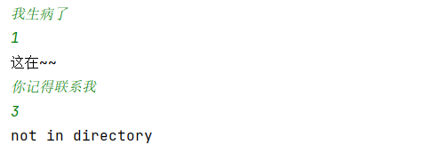

# ECM-replication

### Requirement

python 3.8.1, torch 1.8.1, jieba 0.42.1

### Introduction

Replicate Emotion Classifier with LSTM and Emotional Conversation Generation with Emotional Embedding and Internal Memory (not realize external memory). For classifier, use BiLSTM to train for emotional classifier following the essay *Emotional Chatting Machine: Emotional Conversation Generation with Internal and External Memory*.[2]. Concat first time stamp output and last time stamp output from BiLSTM and use linear layer to produce a 6 dimensions vector to conduct the classification of emotion with 0.001 learning rate and 50 epoches. But the classification of LSTM can only reach about 0.48. For encoder-decoder and attention mechanism, I follow the realization in Pytorch official website[1]. Then, add emotion embedding and internal memory with write gate and read gate for emotional chatting machine following the essay of *Emotional Chatting Machine: Emotional Conversation Generation with Internal and External Memory*.[2]

The dataset I use is the *stc-3_emotion_train.json*.

### Instruction for Emotional Conversation Generation

###### 1. parameter

`cntt`: In prepareData method. The training data size for ECM. It means the number of conversations for training.

`punctuation`: In prepareData method. The punctuation that needs to be filtered.

###### 2. usage

First line is the input for the first sentence in the conversation.

Second line is for the wanted emotion index for answer.(0 for no special emotion, 1 for like, 2 for sad, 3 for angry, 4 for disgust, 5 for happy)

Third line is the generated answer. If some words are not in directory, then the output will be "not in directory".

Results shown as follow:

### Shortage

1. Not add GPU acceleration. Need to add GPU for both device and code.
2. The quality of dataset is not good enough. It has some grammar error and wrong characters. Need to change the dataset.
3. Need more refinement later. Only encoder-decoder and attention model in pytorch official site are not enough. Need more techniques for better answer.

### Reference

[1] [NLP From Scratch: Translation with a Sequence to Sequence Network and Attention — PyTorch Tutorials 1.9.0+cu102 documentation](https://pytorch.org/tutorials/intermediate/seq2seq_translation_tutorial.html)

[2] [[1704.01074\] Emotional Chatting Machine: Emotional Conversation Generation with Internal and External Memory (arxiv.org)](https://arxiv.org/abs/1704.01074)
